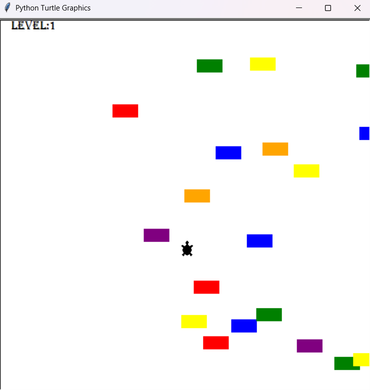

# TURTLE CROSSING GAME
* #### A simple arcade-style game built using Python's turtle module. The goal is to help the turtle cross the road without getting hit by the cars!

## 🚀 Features
* Move the turtle using the Up Arrow key.

* Randomly generated cars drive across the screen.

* Each time the turtle successfully crosses, the level increases and cars move faster.

* Collision detection ends the game with a "Game Over" message.

* Scoreboard tracks how many successful crossings you've made.

__🧠 Game Logic
Turtle Movement__: Controlled with the Up arrow key using event listeners.

__Car Creation and Movement__: Cars are generated at random intervals and move from right to left.

__Collision Detection__: Game checks if any car is too close to the player and ends the game on collision.

__Level Progression__: Each successful crossing increases the level and car speed.

__Score Tracking__: Displays current score and shows "Game Over" when the turtle is hit.

## 📁 File Structure
* main.py - The main game loop and setup logic.

* player.py - Contains the Player class to control the turtle.

* car_manager.py - Manages creation, storage, and movement of cars.

* scoreboard.py - Manages score display and game over screen.

__🕹️ Controls__

* Up Arrow (↑): Move the turtle up.

__📝 Requirements
Python 3.x__

__Uses the built-in turtle and time modules — no additional installations needed.__

__▶️ Running the Game__

Make sure all Python files (main.py, player.py, car_manager.py, scoreboard.py) are in the same directory.

* __Run main.py__:

🎮 Gameplay Preview
A turtle at the bottom of the screen dodges horizontal car(rectangles) traffic to reach the top. With each successful crossing, cars (rectangles) get faster and the score increases. Watch out — one hit and it’s game over!

## OUTPUT PIC:
